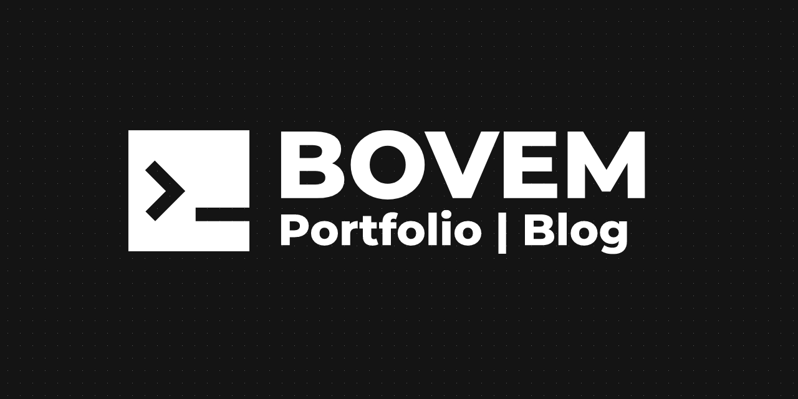

## Project Overview
A [Jekyll](https://jekyllrb.com/) based website hosted on [Netlify](https://www.netlify.com/).  
Deployment URL: [bovem.netlify.app](https://bovem.netlify.app).

## Features
My portfolio and blog.  
<!-- Blogs are based on these topics:
* Discrete Mathematics
* Linear Algebra
* Calculus
* Algorithms
* Operating Systems
* Database Management Systems
* Digital Logic and Design
* Computer Organization
* Computer Networking
* Compiler Design
* Theory of Computation
* C Programming -->

## Screenshots


## Techstack
* Jekyll
* Ruby
* Docker

## Setup
### Pre-requisites
Install [docker](https://www.docker.com/) and [docker-compose](https://docs.docker.com/compose/).
Or install [podman](https://podman.io/).  

### Steps

1. Build container image from Containerfile

```bash
podman build --tag jekyll_blog -f ./Containerfile
```

2. Start `jekyll_blog` container from the container image

```bash
podman run -d --name jekyll_blog -p 7000:7000 -v .:/srv/jekyll:Z jekyll_blog
```

3. Visit `localhost:7000` in your web browser.

## License
[MIT](LICENSE)
