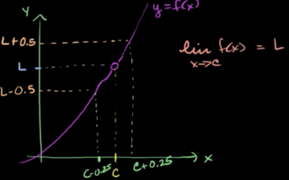

### Basic Idea
You can get $f(x)$ as close to $L$ "as you want" by getting $x$ sufficiently close to $c$.

Example: You can get in the range of $f(x)$ in $(L-0.5, L+0.5)$ if $x$ is within range $(c-0.25, c+0.25)$.

### Formal Definition
Given $\epsilon$ > 0

We can find $\delta$ > 0

Such that if $|x - c|$ < $\delta$

Then $|y - L|$ < $\epsilon$

We can call $\delta$ as a function of $\epsilon$.

This blog was published directly from my notes.
To check the source of my notes and images used in this blog, visit <a href="/credits.html" target="_blank">Credits</a>.

To read my notes, download this <a href="https://github.com/bovem/CS" target="blank">repository</a>.