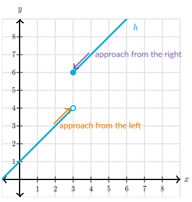
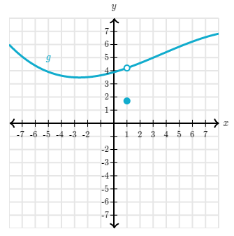
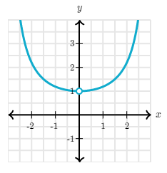

Limit of a function $f(x)$ at a point $x=a$ is the value to which function $f(x)$ is approaching as $x$ is approaching to $a$.

Example: Limit of $f(x)$ as $x$ approaches 3 does not exist in the following image.

Sometimes, value of limit at some point is not equal to value of function at that point.
Example: The limit of $f(x)$ as $x$ approaches 1 is not equal to value of $f(1)$.

Also, if some function is undefined at some point that doesn't guarantee that limit doesn't exist at that point or vice versa.
Example: For $f(x)$ as $x$ approaches 1 exist but function is undefined at $x=1$.

### Subtopics
- [One-Sided Limits]()
- [Formal Definition of Limits]()
- [Properties of Limits]()
- [Limits by Direct Substitution]()
- [Strategy for Finding Limits]()
- [Sandwich Theorem]()

This blog was published directly from my notes.
To check the source of my notes and images used in this blog, visit <a href="/credits.html" target="_blank">Credits</a>.

To read my notes, download this <a href="https://github.com/bovem/CS" target="blank">repository</a>.