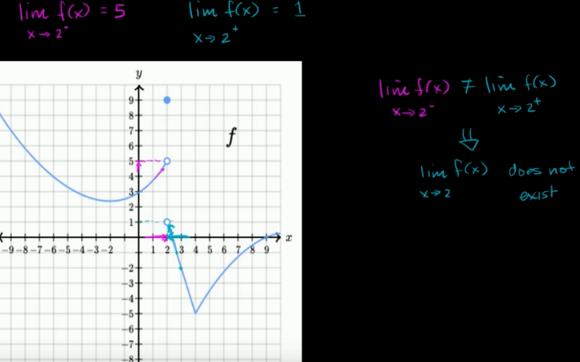

The limit approaching from left should be equal to limit approaching from right. Only then we can say limit exists at a point.

Example: Limits dosen't exist for $f(x)$ at $x=2$.

Limit approaching from left is denoted with superscripted $-$ sign and limit approaching from right is denoted by superscripted $+$ sign.

This blog was published directly from my notes.
To check the source of my notes and images used in this blog, visit <a href="/credits.html" target="_blank">Credits</a>.

To read my notes, download this <a href="https://github.com/bovem/CS" target="blank">repository</a>.