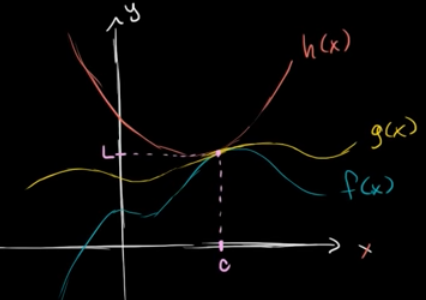
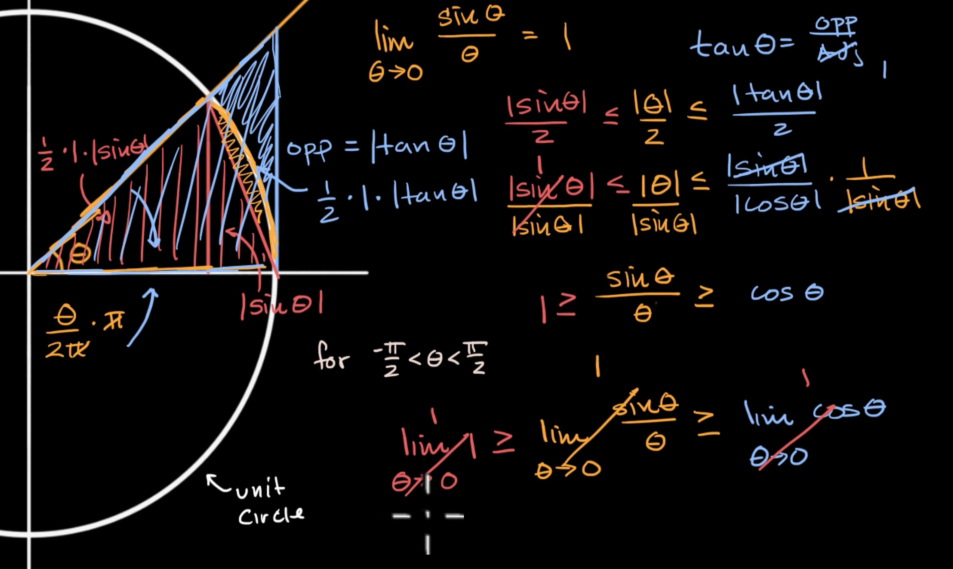

Given $f(x) \leq g(x) \leq h(x)$

then if
$$\lim_{x \rightarrow c} f(x) = L$$

and
$$\lim_{x \rightarrow c} h(x) = L$$

then surely
$$\lim_{x \rightarrow c} g(x) = L$$

Application: Finding value of $sin(\theta) \over \theta$ as $\theta$ approaches 0

$$Area(Red\ Triangle) \leq Area(Wedge) \leq Area(Blue\ Triangle)$$

This blog was published directly from my notes.
To check the source of my notes and images used in this blog, visit <a href="/credits.html" target="_blank">Credits</a>.

To read my notes, download this <a href="https://github.com/bovem/CS" target="blank">repository</a>.