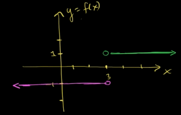

We can find limits by directly substituting value of $x$ in $f(x)$ iff the function is continuous.

$f(x)$ is continuous at $x=a$ iff $\lim_{x \rightarrow a}f(x) = f(a)$.

### Limits of Absolute Functions
Functions having absolute operator could be broken down into piecewise functions like
$$f(x) = {|x-3| \over x-3}$$

could be re-written as
$$

f(x) = \begin{cases} 
      1 & x > 0 \\
      -1 & x < 0
 \end{cases}
$$

It is plotted on graph below

### Limits of Trigonometric Functions
$sin(x)$ and $cos(x)$ are continuous everywhere so

$$\lim_{x \rightarrow a} sin(x) = sin(a)$$

$$\lim_{x \rightarrow a} cos(x) = cos(a)$$

Limits for any input into $sin(x)$ or $cos(x)$ could be obtained by direct substitution.

But other trigonometric functions aren't continuous everywhere so limits for them cannot be calculated by direct substitution all the time.

This blog was published directly from my notes.
To check the source of my notes and images used in this blog, visit <a href="/credits.html" target="_blank">Credits</a>.

To read my notes, download this <a href="https://github.com/bovem/CS" target="blank">repository</a>.