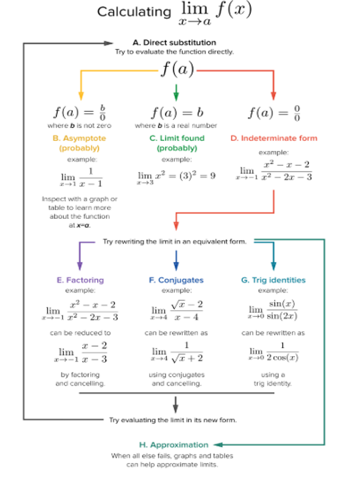

### Factorization
You can factorize the expression
$$f(x) = {x^2 +x-6 \over x-2} = {(x+3)(x-2) \over x-2} = x+3$$

so $f(x)$ could be rewritten as

$$

f(x) = \begin{cases} 
      x+3 & x \neq 2 \\
      undefined & x = 2
 \end{cases}
 $$

 
### Rationalization
You can rationalize the numerator/denominator such that square root ($\sqrt{}$) is eliminated.

$$g(x) = {x+1 \over \sqrt{x+5} -2} = {x+1 \over \sqrt{x+5} -2} \times {\sqrt{x+5} +2 \over \sqrt{x+5}+2} = {x+1 (\sqrt{x+5} +2) \over x+5 - 4} = \sqrt{x+5} +2$$

### Trigonometric Identities
Identities of trigonometry could be applied in the expression.

$$f(x) = {1 - cos(\theta) \over 2(sin(\theta))^2} = {1 - cos(\theta) \over 2(1 - (cos(\theta))^2)} = {1 - cos(\theta) \over 2(1 - cos(\theta))(1 + cos(\theta))} = {1 \over 2(1 + cos(\theta))}$$

$$f(x) = {1 \over 2 + 2 cos(\theta)}, \theta \neq 0$$

$$g(x) = {1 \over 2 + 2 cos(\theta)}$$

$$\lim_{x \rightarrow 0} f(x) = \lim_{x \rightarrow 0} g(x) = {1 \over 2 + 2 cos(0)} = {1 \over 4}$$

### Strategy Map

This blog was published directly from my notes.
To check the source of my notes and images used in this blog, visit <a href="/credits.html" target="_blank">Credits</a>.

To read my notes, download this <a href="https://github.com/bovem/CS" target="blank">repository</a>.